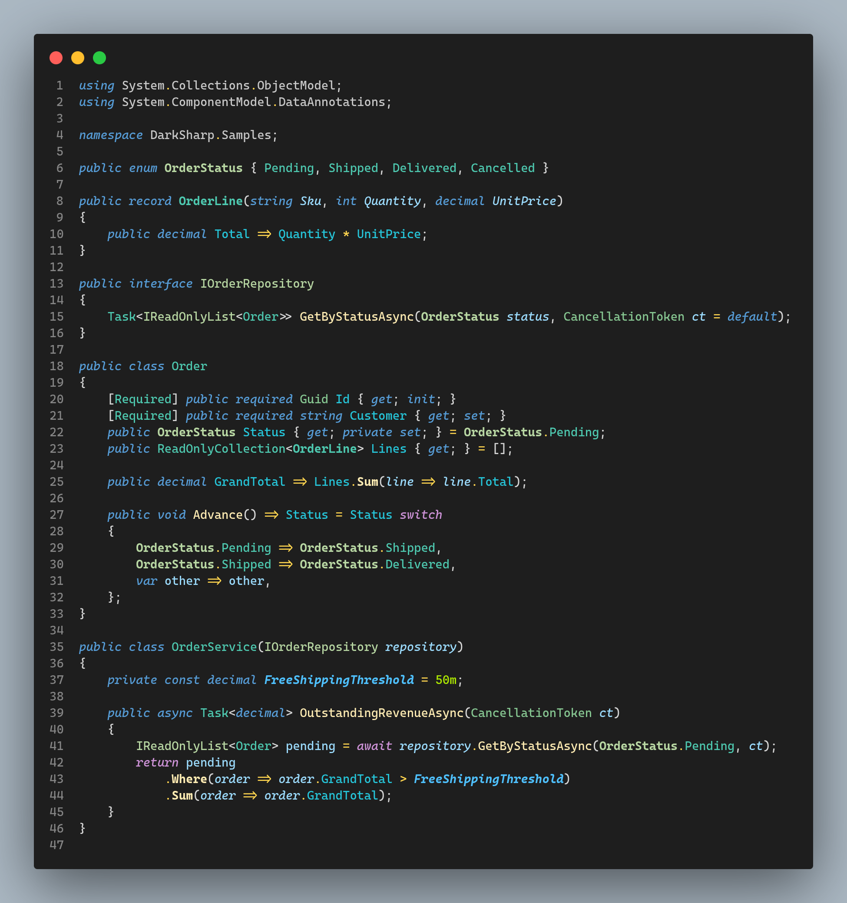

# Dark Sharp

A sharp dark theme for VS Code, built for **Angular** and **.NET** developers —
full semantic color tokens with consistent, shared color customizations across
C# and Angular/TypeScript.

## Get set up in 60 seconds

1. **Install the theme:** press `Ctrl+P`, run `ext install jczacharia.dark-sharp-theme`
   (or grab it from the
   [Marketplace](https://marketplace.visualstudio.com/items?itemName=jczacharia.dark-sharp-theme) /
   [Open VSX](https://open-vsx.org/extension/jczacharia/dark-sharp-theme)),
   then **Preferences: Color Theme** → **Dark Sharp**.

2. **Install the language extensions** that produce the semantic tokens Dark
   Sharp colors:

   | Stack | Extension | Notes |
   | --- | --- | --- |
   | Angular | [Angular Language Service](https://marketplace.visualstudio.com/items?itemName=Angular.ng-template) (`Angular.ng-template`) | Inline **and** separate-file templates, zero config |
   | C# / .NET | [C#](https://marketplace.visualstudio.com/items?itemName=ms-dotnettools.csharp) (`ms-dotnettools.csharp`) | Ships the Roslyn language server that provides C# semantic tokens |

   [C# Dev Kit](https://marketplace.visualstudio.com/items?itemName=ms-dotnettools.csdevkit)
   is optional — it adds solution explorer and test tooling on top of the C#
   extension, not highlighting.
   [C# by ReSharper](https://marketplace.visualstudio.com/items?itemName=JetBrains.resharper-code)
   works too, but it uses its own analysis engine — the stock C# extension is
   what Dark Sharp is tuned against.

3. **Add to your `settings.json`:**

   ```json
   "editor.semanticHighlighting.enabled": true
   ```

   Dark Sharp already opts into semantic highlighting on its own
   (`"semanticHighlighting": true` in the theme), so this line is a guarantee —
   it re-enables semantic tokens if another profile or setting turned them off.

That's it. No other settings are needed for either stack.

## Why Dark Sharp

- **Semantic tokens first.** Colors are driven by semantic tokens from the
  language servers (Roslyn, Angular Language Service, TypeScript), not just
  TextMate scopes — so a parameter, field, or interface looks the same
  everywhere it appears.
- **Tuned for Angular templates.** Designed and scrutinized for both inline
  and separate-file templates: semantic HTML elements, Angular input and
  attribute bindings, structural directives, and interpolation are each easy
  to tell apart at a glance.
- **Consistent across stacks.** C# and Angular/TypeScript share the same
  semantic palette, so switching between backend and frontend doesn't mean
  re-learning colors.

## Screenshots

### C\#



### Angular — inline template


### Angular — separate template


## Development

Screenshots are generated automatically (requires Node ≥ 20 and the .NET SDK):

```bash
npm install
npm run screenshots
```

This spins up an isolated VS Code instance with the C# and Angular Language
Service extensions, opens the sample workspace in `samples/`, waits for
semantic highlighting to settle, and writes PNGs to `images/`.

## License

[MIT](LICENSE)
